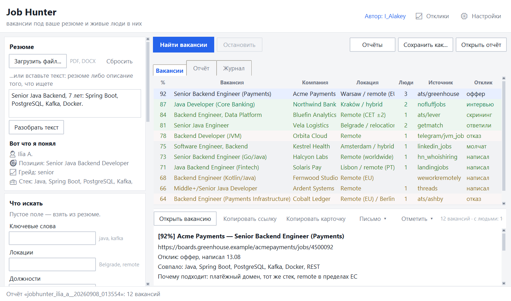
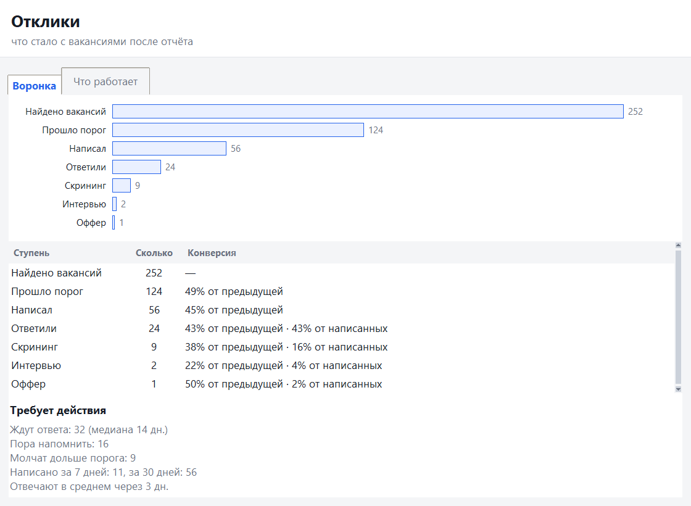
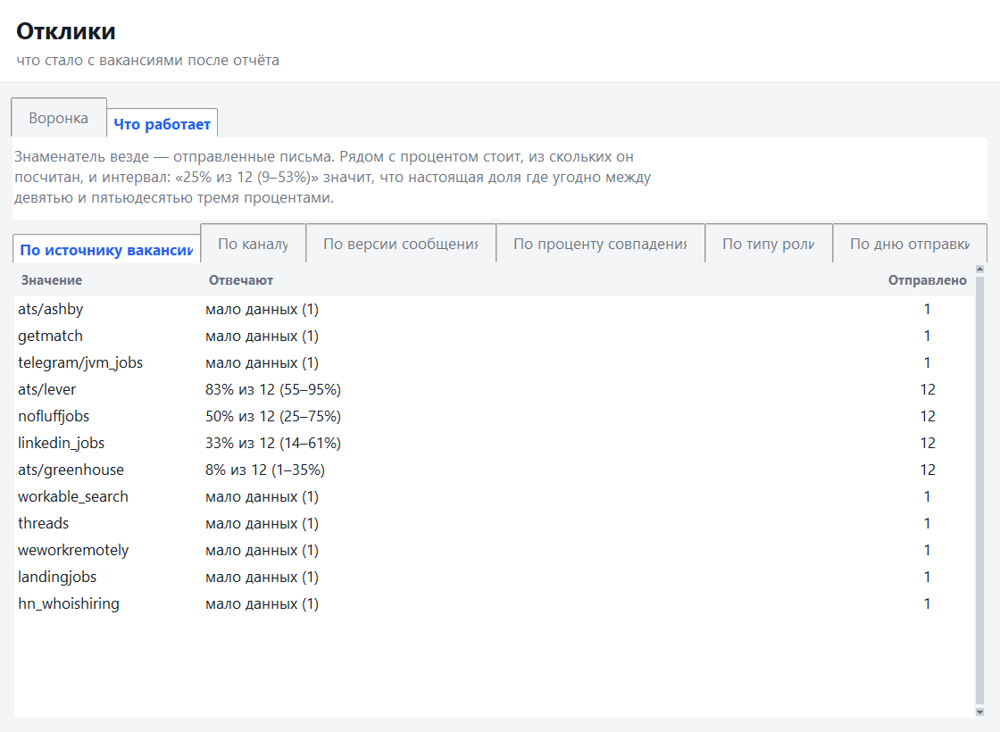
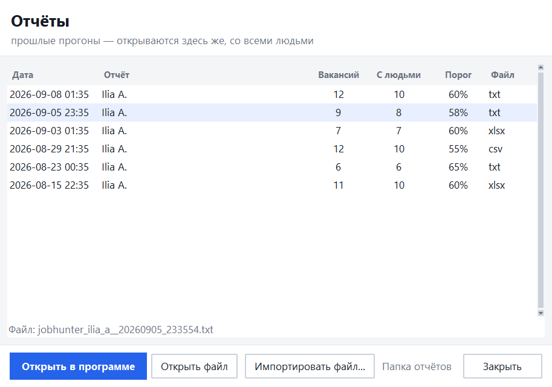
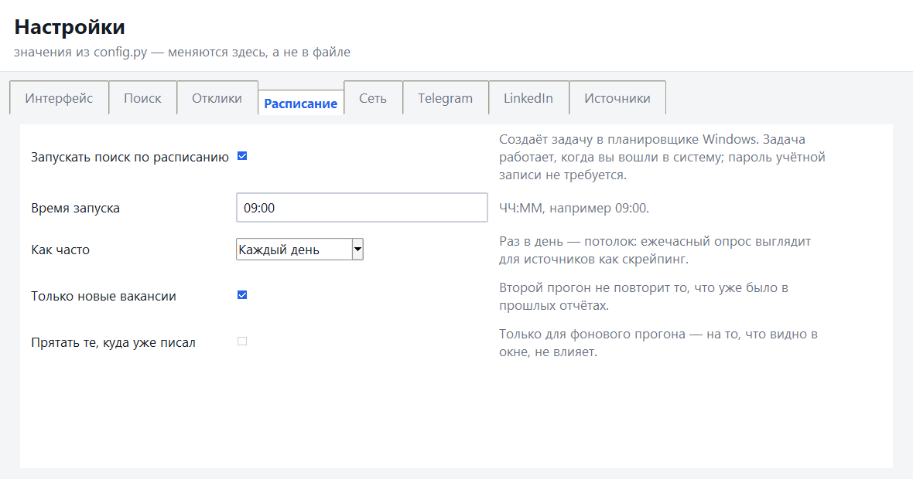

# resume2human

[English](README.md) · **Русский**

Инструмент решает одну задачу: из вашего резюме получить **список вакансий
с высоким соответствием → 1-3 живых человека на каждую, которым можно написать
самому** — и потом помнить, на какое из этих писем ответили.

Никакой автоматической рассылки, ни одного API-ключа, ничего не отправляется
от вашего имени. Поиск, скоринг, контакты и запись о том, что вы с ними
сделали.

Приложение работает на вашей машине: окно вместо консоли, данные — в папке
рядом с exe.

<p align="center">
  
</p>

---

## Скачать

Windows 10/11, 64 бита. Python и что-либо ещё ставить не нужно.

**→ [resume2human-windows.zip](https://github.com/ialakey/resume2human/releases/download/latest/resume2human-windows.zip)** — всегда последняя сборка.

1. Распакуйте архив **целиком**. Внутри папка, а не один файл: exe без соседних
   файлов не запустится.
2. Запустите `JobHunter\JobHunter.exe`.

### Почему Windows ругается и что можно проверить вместо этого

При первом запуске SmartScreen скажет «Windows защитила ваш компьютер» →
«Подробнее» → «Выполнить в любом случае». Так будет до тех пор, пока сборка не
подписана сертификатом публичного удостоверяющего центра: это платно, а
репутация у SmartScreen набирается скачиваниями и временем. Делать вид, что
это не так, — как раз то, чему не стоит доверять.

Что проверяется **без** веры в написанное на этой странице:

* **SHA-256 архива напечатан в описании релиза**, рядом со ссылкой на
  скачивание. Его считает сама сборка, из того же файла, который следующей
  строкой уходит в релиз. Сверьте после скачивания:

  ```powershell
  Get-FileHash resume2human-windows.zip -Algorithm SHA256
  ```

  Другой хеш — значит, у вас не тот файл, который собрали.
* **Сборка не делается руками.** Каждый push прогоняет тесты, собирает exe
  через PyInstaller, запускает `--selftest` *внутри собранного файла* и только
  после этого публикует релиз здесь. Сборка, которая не может открыть
  собственные парсеры и запустить браузер, до этой страницы не доходит.
* **Программа говорит о себе то же самое.** Прежде чем доверять окну, спросите
  у exe:

  ```powershell
  JobHunter.exe --selftest      # результат в data\selftest.log
  ```

* **Наружу ничего не уходит.** Ни ключа, ни аккаунта, ни телеметрии. Единственный
  исходящий трафик — запросы к самим источникам вакансий, по тем же адресам,
  которые вы открыли бы в браузере. См. [Приватность](#приватность).

Нумерованные релизы (`v1.2.0`) лежат на [странице релизов](https://github.com/ialakey/resume2human/releases);
`latest` — это то же самое, но пересобираемое на каждое изменение.

Язык интерфейса — русский по умолчанию, переключается в **⚙ Настройки →
Интерфейс → Язык интерфейса**. За ним идут и окно, и настройки, и отчёт;
перезапуск не нужен.

## Как пользоваться

1. **Резюме.** Перетащите файл (PDF, DOCX, TXT, MD, RTF) или вставьте текстом.
   Можно и просто описать, что ищете: «Senior Java, Kafka, Рига или remote».
   Приложение сразу показывает, что поняло: стек, грейд, позицию — это стоит
   проверить глазами, потому что профиль умножается на каждую вакансию в прогоне.
2. **Параметры поиска.** Ключевые слова, локации, должности, порог совпадения,
   галочка «Только удалённые вакансии» и выбор источников. Пустое поле =
   «взять из резюме», все галочки источников = «без ограничения».
3. **LinkedIn — необязательно.** Кнопка «Войти в LinkedIn» открывает браузер,
   вы входите сами (со своей 2FA и капчей), приложение забирает готовую сессию.
   **Пароль нигде не вводится и не хранится.** Без сессии контакты ищутся
   только по открытым источникам — просто их будет меньше.
4. **«Найти вакансии».** Прогресс — в строке состояния и на вкладке «Журнал»;
   «Остановить» прерывает прогон в любой момент.
5. **Результат** — на вкладке «Вакансии»: таблица с колонками «%», «Вакансия»,
   «Компания», «Локация», «Люди», «Источник» и «Отклик». Любой заголовок
   сортирует, цвет строки показывает силу совпадения. Под таблицей — карточка
   выбранной вакансии и кнопки:

   * **Открыть вакансию** (или двойной клик по строке);
   * **Копировать ссылку**;
   * **Копировать карточку** — процент, что совпало, почему подходит и найденные
     люди с адресами;
   * **Письмо** — первое сообщение по шаблону и этой карточке;
   * **Отметить** — что вы с этой вакансией сделали.

   Текстовый отчёт по всему прогону — на вкладке «Отчёт» и в `data\reports\`.

## Что происходит после отчёта

Раньше поиск заканчивался отчётом, и дальше программа не знала ничего. Теперь
знает.

**Отметить.** «Отметить» → «Написал» с выбором канала (почта, LinkedIn,
Telegram, форма, через знакомого), дальше «Ответили», «Скрининг», «Интервью»,
«Оффер», «Отказ». Строка меняет цвет, в колонке «Отклик» появляется статус,
и он же печатается в отчёте.

Назад по лестнице нельзя: «разответить» письмо нечем. Ошиблись — «Снять
отметку», и отклик вернётся в исходное состояние вместе с датами.

**Молчание считается, а не проставляется.** Отклик становится «молчат» от того,
что прошло заданное число дней без ответа. Статус, который надо ставить самому,
не ставит никто, и воронка тихо врёт.

**Письмо.** Кнопка «Письмо» собирает первое сообщение из шаблона и карточки:
подставляет имя человека, компанию, должность и ту самую строку «почему я
подхожу именно этой вакансии», которую программа и так считает на каждом
прогоне. Шаблонов два с самого начала, и это не случайность: чтобы разрез
«по версии сообщения» что-то показал, версий должно быть больше одной.
Правятся в `data\templates.json` — **«Письмо» → «Изменить шаблоны…»**; список
доступных подстановок записан в самом файле.

Когда после «Скопировать письмо» нажимают «Написал», программа запоминает,
какой версией оно написано. Иначе сравнивать было бы нечего.

**Дашборд** — кнопка «📈 Отклики» в шапке. Две вкладки:

<p align="center">
  
</p>

*Воронка* — найдено → прошло порог → написал → ответили → скрининг → интервью
→ оффер, с конверсией на каждой ступени. Рядом то, что требует действия
сегодня: сколько ждут ответа, кому пора напомнить, кто молчит дольше порога,
сколько написано за 7 и за 30 дней.

<p align="center">
  
</p>

*Что работает* — response rate по источнику вакансии, каналу, версии письма,
полосе совпадения, типу роли и дню отправки.

Проценты там честные. Рядом с каждым стоит, из скольких писем он посчитан, и
интервал: «25% из 12 (9–53%)». Пока писем меньше восьми, процент не
показывается вовсе — вместо него «мало данных». На пяти письмах разницы между
источниками не существует, и дашборд, который делает вид, что она есть, хуже
отсутствия дашборда.

## Отчёты, которые открываются обратно

<p align="center">
  
</p>

Каждый поиск сохраняет два файла с одним именем: документ для чтения (`.txt`,
`.csv` или `.xlsx` — **«Настройки» → «Формат отчёта»**) и `.json` рядом с ним.
Читает человек первый, открывает обратно программа — второй.

* **«Отчёты»** — список всего, что этот компьютер уже находил: дата, сколько
  вакансий, у скольких нашлись люди, порог и формат файла. Двойной клик по
  строке — и прогон недельной давности снова в таблице, со всеми контактами.
  Оттуда же **«Импортировать файл…»**: отчёт с другой машины открывается так
  же, как свой.
* **«Сохранить как…»** — тот же прогон в другом формате: текст, CSV или Excel.
  Формат выбирается расширением в диалоге сохранения.
* **«Открыть отчёт»** — открыть сам файл тем, чем его открывает система.

В архиве нет ни текста резюме, ни описаний вакансий: ни то, ни другое отчёт не
печатает, а файлами люди обмениваются.

Табличные форматы (`.csv` и Excel) — это строка на человека, а не на вакансию:
вакансия повторяется рядом с каждым найденным контактом, потому что
единственный смысл открывать отчёт в Excel — фильтровать и сортировать.
Вакансия, у которой людей не нашлось, свою строку всё равно получает.

Статусы **не хранятся в архиве**. Архив — снимок прогона, и он честен тем, что
не меняется; статус живёт в базе и накладывается каждый раз, когда отчёт
открывают или экспортируют. Открыли прошлонедельный отчёт — увидели сегодняшнюю
правду, а не «написал» над вакансией, по которой давно отказ.

## По расписанию

<p align="center">
  
</p>

**«Настройки» → «Расписание»**: галочка, время, каждый день или по будням.
Программа сама создаёт задачу в планировщике Windows и сама её удаляет, когда
галочку снимают. Задача запускает `JobHunter.exe --scan` — тот же прогон, без
окна.

Три вещи, которые стоит знать про такую задачу:

* она работает, **когда вы вошли в систему**. Вариант «независимо от входа»
  требует сохранённого пароля учётной записи, а запуск от `SYSTEM` ломает
  и пути, и браузер;
* если папку с программой перенести, задача продолжит указывать на старое
  место. Программа замечает это при запуске и предлагает пересоздать;
* LinkedIn в фоновом прогоне выключен. Браузерная ступень требует живой сессии
  и ведёт себя как человек за компьютером — ночью, без пользователя, она даёт
  только риск для аккаунта.

Результат приходит тремя путями: `data\scheduled.log`, Telegram, если включены
уведомления (**«Настройки» → «Telegram»**: галочка, токен бота и чат), и плашка
«пока вас не было: 3 новых вакансии» при следующем открытии окна.

Раз в день — разумный потолок. Ежечасный опрос выглядит для источников как
скрейпинг, и программа в любом случае уважает минимальную паузу между прогонами.

## Откуда берутся вакансии

Все источники публичные, опрашиваются параллельно:

* **ATS компаний напрямую** — Greenhouse, Lever, Ashby, Recruitee,
  SmartRecruiters, Workable;
* **агрегаторы удалёнки** — RemoteOK, We Work Remotely, Arbeitnow, Remotive,
  Jobicy, Working Nomads, Himalayas, The Muse, Empllo, тред «Who is hiring» на
  Hacker News;
* **доски одного рынка** — NoFluffJobs (Польша), getmatch, Landing.jobs (ЕС),
  Djinni и DOU (Украина и remote вокруг неё), Habr Career, GeekJob;
* **LinkedIn** — вакансии (гостевой доступ) и посты «мы нанимаем» (по вашей
  сессии);
* **посты** — публичные Telegram-каналы и threads.com;
* **веб-поиск** — Bing и DuckDuckGo без ключа, как запасной канал.

## Как считается совпадение

Скоринг детерминированный и объяснимый, без ML и без обращений к чужим моделям.

* Из резюме собирается профиль: обязательные навыки (`must have`), желательные
  (`nice to have`), грейд, стаж, домены, локации, стоп-слова.
* Дешёвый префильтр по пересечению навыков отсекает основную массу вакансий,
  и только выжившие считаются полностью: **match 0-100**, соответствие грейда,
  чего не хватает из обязательного, что сработало как стоп-слово, почему
  вакансия подходит.
* Половина итогового балла — покрытие обязательных навыков, поэтому их держат
  короткими: язык и фреймворк, а не весь стек. Всё остальное — в желательные,
  они добавляют очки, но никогда не блокируют.
* В отчёте видно и что совпало, и чего не хватило — можно спорить с оценкой,
  а не принимать её на веру.

## Как ищутся люди

Для вакансий выше порога инструмент идёт по лестнице и останавливается, как
только набрал нужное число контактов:

1. контакты прямо в тексте вакансии;
2. страницы компании — careers, team, about, people;
3. профили LinkedIn: роли выбираются **от вакансии** (Engineering Manager,
   Head of, VP, CTO, рекрутер направления), а не «все подряд»;
4. веб-поиск как последний ярус.

На выходе — имя, роль и адрес. Дальше письмо пишете вы.

Есть ещё одна ступень, **по умолчанию выключенная** («Настройки» → «Отклики» →
«Достраивать вероятные адреса»): собрать адрес из имени и домена, когда почту
человека никто не публиковал. Такие адреса помечены в отчёте как непроверенные:
письмо по ним может отскочить, а отскоки портят репутацию отправителя.

## Что инструмент не делает

* не рассылает сообщения и откликов за вас не оставляет — и не будет: он
  доводит до строки «вот человек и вот его адрес», и на этом останавливается.
  «Письмо» кладёт текст в буфер обмена, а не в исходящие;
* записывает то, что вы **сами** отметили — один клик на шаг, — а не следит за
  вашей почтой, чтобы догадаться;
* не требует ни одного API-ключа и не отправляет ваше резюме ни в один сервис.

## Приватность

Резюме, профиль, база вакансий, отклики и сессия LinkedIn остаются на вашем
компьютере — в той же папке, куда вы распаковали архив:

```
JobHunter\
├── JobHunter.exe
├── job_hunter.db          вакансии, вердикты, контакты, отклики
├── profile\search.json    параметры поиска
├── linkedin_cookies.json  сессия LinkedIn (если вы входили)
└── data\
    ├── reports\           документ на каждый прогон и .json рядом с ним
    ├── templates.json     ваши шаблоны писем
    ├── settings.json      всё, что меняли в окне настроек
    ├── scheduled.log      что сделал фоновый прогон
    └── desktop.log        журнал вместо консоли
```

Удалить папку = удалить все данные. Наружу уходят только запросы к самим
источникам вакансий — и, если вы сами включили галочку, готовый отчёт в ваш
собственный чат в Telegram.

Браузер для LinkedIn приложение с собой не носит — это лишние 150 МБ на каждую
копию. Берётся первый доступный: Chromium от Playwright, если он у вас уже
скачан, иначе установленный Chrome или Edge, иначе в окне появится кнопка
«Скачать Chromium».

## Ограничения

* Скоринг — весовой алгоритм по ключевым словам. Он объясним, но не понимает
  контекст: «Java» в списке требований и «Java» в строчке про легаси для него
  одно и то же.
* Веб-поиск — публичный скрейпинг без ключа. При частых прогонах поисковик
  начинает отдавать капчу; движок тогда ставится на паузу, а запрос уходит
  следующему. Отчёт пишет об этом отдельным предупреждением, чтобы пустой
  список людей не читался как «в этих компаниях никого нет».
* Разбор постов (Telegram, Threads, LinkedIn, Hacker News) эвристический: люди
  пишут свободным текстом, поэтому название компании иногда угадывается
  неточно. Если работодатель не назван вовсе, в отчёте стоит автор поста — это
  честнее выдуманного названия.
* Поиск по постам LinkedIn требует живой сессии и не умеет фильтровать по
  географии; без сессии источник молча отдаёт пустой список.
* Разметка LinkedIn и поисковиков меняется. Все парсеры при поломке отдают
  пустой результат и пишут предупреждение в журнал, а не роняют прогон.
* Воронка честна ровно настолько, насколько вы отмечаете. Письмо, которое вы
  отправили и не отметили, в неё не попадёт.

## Исходный код

Этот репозиторий — витрина: README, скриншоты и релизы. Разработка идёт в
приватном репозитории, каждый сборочный прогон там прогоняет тесты, собирает
exe, запускает `--selftest` внутри собранного файла и только после этого
обновляет релиз здесь.

Вопросы и баг-репорты — в [Issues](https://github.com/ialakey/resume2human/issues).
К отчёту об ошибке полезно приложить `data\desktop.log`.
